# Plantas&co. Shop

Plantas&co. is a fictitious online shop that sells all kinds of indoor plants, but also dry flowers bouquets. 
Besides shopping, users of Plantas&co. will find a blog where both beginners and expers can find some useful tips on how to take care of their plants.

---
#### CONTENT
- <a href="#1-UX">1. UX</a>
  - <a href="#1-UX-1">1.1 Project Goals</a>
  - <a href="#1-UX-2">1.2 User Stories</a>
  - <a href="#1-UX-3">1.3 Design Choices</a>
  - <a href="#1-UX-4">1.4 Database Design</a>
  - <a href="#1-UX-5">1.5 Wireframes</a>
- <a href="#2-FEAT">2. Features</a>
  - <a href="#2-FEAT-1">2.1 Existing Features</a>
  - <a href="#2-FEAT-2">2.2 Potential Features</a>
- <a href="#3-TECH">3. Technologies Used</a>
- <a href="#4-TEST">4. Testing</a>
- <a href="#5-DEPL">5. Deployment</a>
- <a href="#6-CRED">6. Credits</a>

---
 

## 1. UX

### 1.1 Project Goals
The primary goal of Plantas&co. shop is to provide a clean, intuitive online shop where the user can browse and purchase different types of plants easily. 

Another main goal is to provide the users with a blog to keep them informed with advice to take care of their plants at home.

### 1.2 User Stories

##### Viewing and Navigation
- As a shopper, I want to be able to view a list of products so that I can select some to purchase
- As a shopper, I want to be able to view individual product details so that I can identify the price, description and product image
- As a shopper, I want to be able to easily view the total of my purchases at anytime so that I can avoid spending too much
- As a shopper, I want to be able to read more about plants so that I can learn a few tips about how to take better care of them

##### Registration and User Account
- As a site user, I want to be able to easily register for an account so that I can have a personal account and be able to view my profile
- As a site user, I want to be able to easily login or logout so that I can access my personal account information
- As a site user, I want to be able to easily recover my password in case I forget it so that I can recover access to my account
- As a site user, I want to be able to receive an email confirmation after registering so that I can verify that my account registration was successful
- As a site user, I want to be able to have a personalized user profile so that I can view my personal order history and order confirmation, save my payment information and see the products I saved in my favourites list
- As a site user, I want to be able to save products in my wishlist so that I can revisit them if I want to buy them later

##### Sorting and Searching
- As a shopper, I want to be able to sort the list of available products so that I can easily identify the best priced and categorically sorted products
- As a shopper, I want to be able to sort a specific category of product so that I can find the best-priced product in a specific category, or sort the products in that category by name
- As a shopper, I want to be able to sort multiple categories of products simultaneously so that I can find the best-priced products across broad categories, such as "indoor plants" or "dry flowers"
- As a shopper, I want to be able to search for a product by name or description so that I can find a specific product I'd like to purchase
- As a shopper, I want to be able to easily see what I've searched for and the number of results so that I can quickly decide whether the product I want is available

##### Purchasing and Checkout
- As a shopper, I want to be able to easily select the quantity of a product when purchasing it so that I can ensure I don't accidentally select the wrong product or quantity
- As a shopper, I want to be able to view items in  my bag to be purchased so that I can identify the total cost of my purchase and all items I will receive
- As a shopper, I want to be able to adjust the quantity of individual items in my bag so that I can easily make changes to my purchase before checkout
- As a shopper, I want to be able to easily enter my payment information so that I can check out quickly and with no hassles
- As a shopper, I want to be able to feel my personal and payment information is safe and secure so that I can confidently provide the needed information to make a purchase
- As a shopper, I want to be able to view an order confirmation after checkout so that I can verify that I haven't made any mistakes
- As a shopper, I want to be able to receive an email confirmation after checking out so that I can keep the confirmation of what I've purchased for my records

##### Admin and Store Management
- As a store owner, I want to be able to add a product so that I can add new items to my store
- As a store owner, I want to be able to edit/update a product so that I can change product prices, descriptions, images and other product criteria
- As a store owner, I want to be able to delete a product so that I can remove items that are no longer for sale

### 1.3 Design Choices

**Fonts**: 
- The main font Raleway was chosen for being a clear, aesthetic and readable font.
- The secondary font Playfair Display was used to create the logo for having an elegant feeling.

Both fonts were imported from [Google Fonts](https://fonts.google.com/)

**Colors**:
To give the project a clean look, the main colors chosen were off-black and off-white, with two shades of blue-green to emphasize some areas like the shop now button.

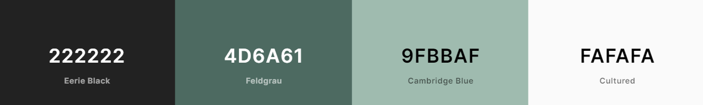

**Images**:

- The images used for the main page, blog and background were selected to provide the website with a 'real' plants shop appearence. These belong to [Ceyda Çiftci](https://unsplash.com/@ceydaciftci) in [Unsplash](https://unsplash.com/)
- All the images used as product images belong to [Severin Candrian](https://unsplash.com/@feeypflanzen) in [Unsplash](https://unsplash.com/)

### 1.4 Database Design

### 1.5 Wireframes

The wireframes were designed using [Balsamiq](https://balsamiq.com/). They're accessible in the following links:
 
|    Home Page    |    Profile Page    |    Wishlist Page    |
|    :----:    |    :----:    |    :----:    |
|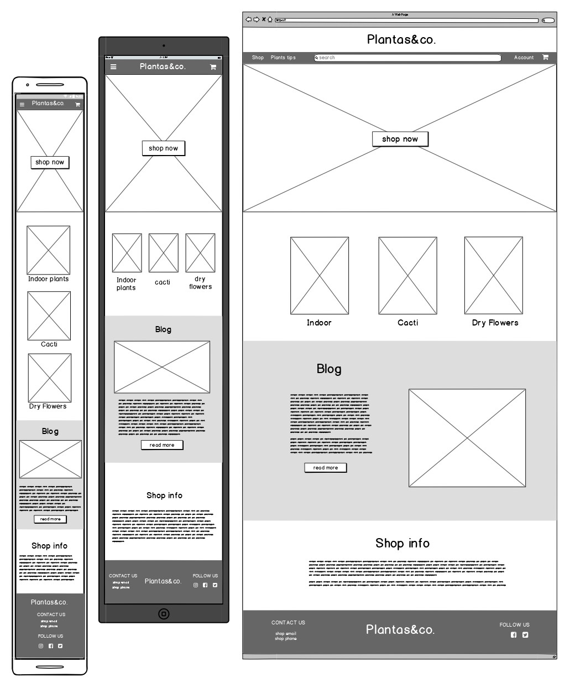|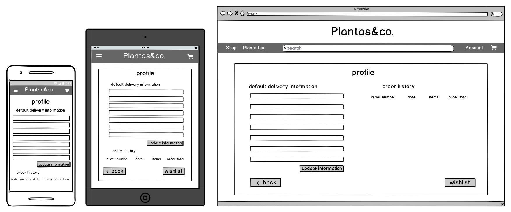|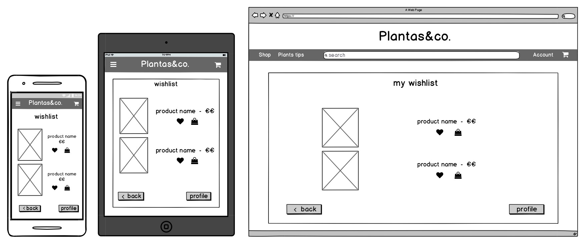|

|    Products Page    |    Product Detail Page    |    Add/Edit Product Page    |
|    :----:    |    :----:    |    :----:    |
|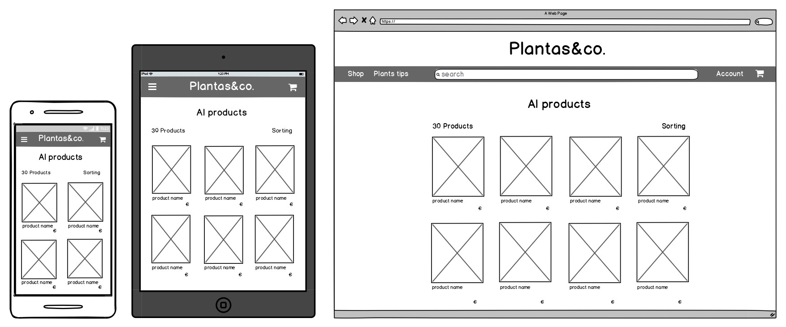|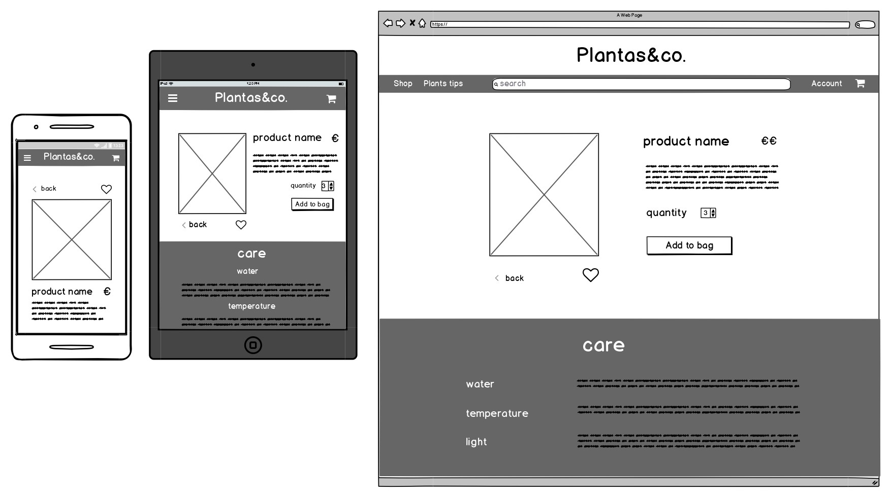||

|    Bag Page    |    Checkout Page    |    Checkout Success Page    |
|    :----:    |    :----:    |    :----:    |
|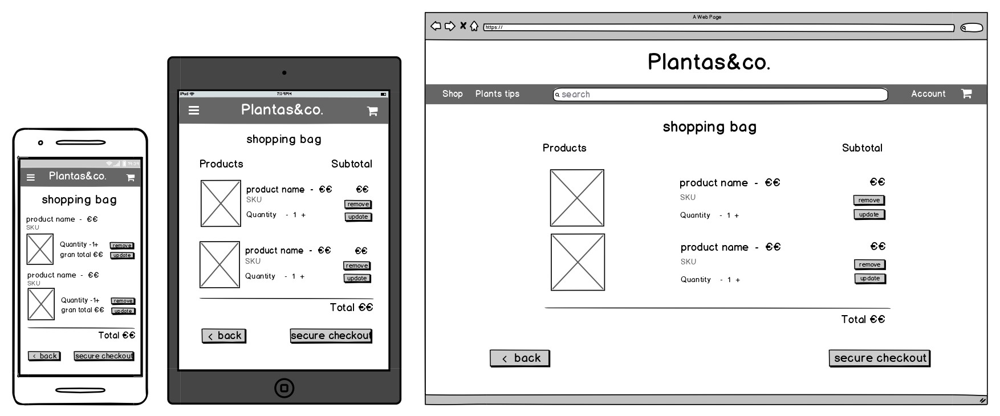|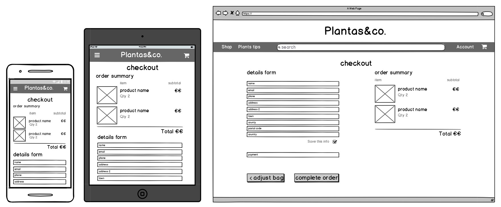|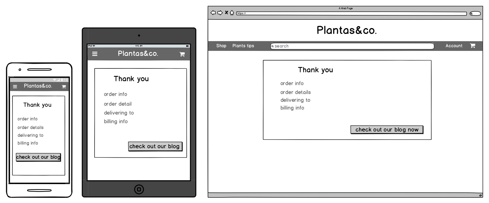|

|    Blog Page    |    Blog Post Page    |    Add/Edit Blog Post Page    |
|    :----:    |    :----:    |    :----:    |
|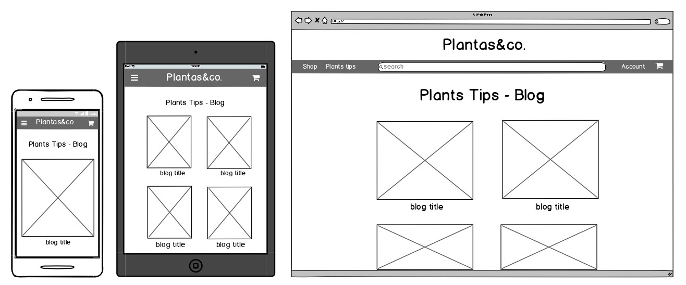|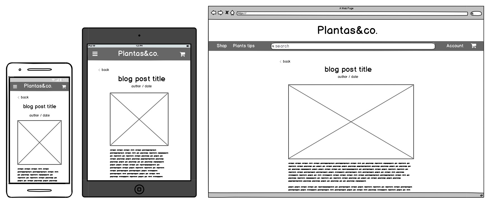|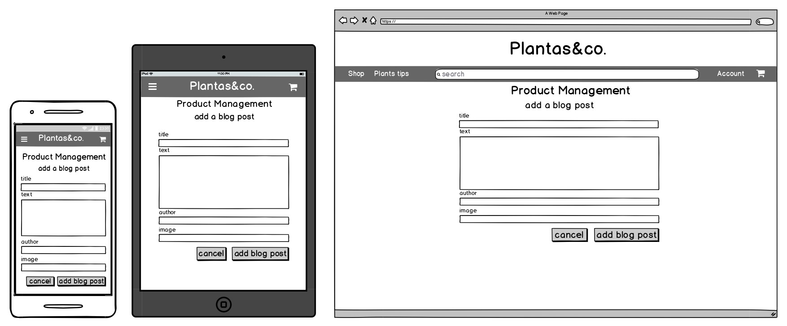|

---

## 2. Features

### 2.1 Existing Features
 
**Site wide**:
- **Navbar**: gives consistency and allow users to navigate the site in an easy and intuitive way. There are two versions of it: one for larger screen sizes and one for smaller screen sizes. Both of them include the same features:

  - **Home Button**: allows users to go back to the Home page from any part of the page
  - **Shop Button**: opens a side menu in larger screen sizes and a dropdown in mobile that allows users to go to the 'All Products' page and to the main categories: Indoor Greenery, Cacti and Dry Flowers
  - **Plants Tips Button**: allows users to go to the Blog
  - **Logo**: allows users to identify where they are and to go back to the Home page from any part of the page.
  - **Search Icon Button**: in larger screen sizes opens a side nav menu that allow users to search for any product in the shop
  - **Bag Icon Button**: allows users to access the Shopping Bag page from any part of the site
  - **Account Button**: opens a side menu in larger screen sizes and a dropdown in mobile that shows different features depending on the user type:
    - Anonymous users can see a ‘Register’ and a ‘Login’ link
    Registered users can see a ‘My Profile’, ‘My Wishlist’ and ‘logout’ links
    Superusers can see the same ‘My Profile’, ‘My Wishlist’ and ‘Logout’ links and also ‘Product Management - Add Product’ and ‘Product Management - Add Blog Post’ 

- **Footer**:
  - **Contact Us**: informs users of the shop's (fake) contact details
  - **Logo**: reminds users where they are and to go back to the Home page from any part of the page.
  - **Follow Us**: allows users to view the shop's (fake) social accounts

- **Home Page**: 
  - **Jumbotron**: works as a call to action and includes a button for the users to go directly to the All Products page
  - **Links to main categories**: allows users to access directly the category they are searching for: Indoor Plants, Dry Flowers and Cacti
  - **Blog Link**: informs the user that the shop also offers advice about plants and encourage them to visit the blog
  - **Shop values**: gives the users a quick glance about the shop's values

- **Products Page**

- **Product Detail Page**

- **Bag Page**

- **Checkout Page**

- **Checkout Success Page**

- **Profile Page**

- **Wishlist Page**

- **Blog Page**

- **Blog Post Page**

- **Register Page**

- **Log In Page**

- **Log Out Page**

Restricted to Superusers

- **Add Product Page**

- **Edit Product Page**

- **Add Blog Post Page**

- **Edit Blog Post Page**

 

### 2.2 Potential Features

---

## 3. Technologies Used

#### Languages
- [HTML5](https://html.com/) provides the content and structure for the project.
- [CSS3](http://www.css3.info/) provides the styling.
- [JavaScript](https://www.javascript.com/) provides the functionality and interaction.
- [Python3](https://www.python.org/) provides the backend for the project.

#### Frameworks & Libraries
- [Bootstrap](https://getbootstrap.com/) is used to create the layout of the project and some styling.
- [Django](https://www.djangoproject.com/) is used to get a rapid development and a clean, pragmatic design.
- [PostgresSQL](https://www.postgresql.org/) is the database used to store all the models in the production environment. 
- [SQLite](https://sqlite.org/index.html) is used as the database in the development environment.
- [AWS](https://aws.amazon.com/) is used to host media and static files on the cloud.
- [Stripe](https://stripe.com/) is used for payment handling.
- [Google Fonts](https://fonts.google.com/) is used to provide the fonts: Raleway and Playfair Display.
- [Font Awesome](https://fontawesome.com/) is used to provide some icons.

#### Project Management
- [Git](https://git-scm.com/) is used for version control.
- [GitHub](https://github.com/) is used to host the project.
- [Heroku](https://www.heroku.com/) is used to deploy the app.
- [Gitpod](https://gitpod.io/) was used to develop the website.

#### Design
- [Balsamiq](https://balsamiq.com/) was used to create the project's wireframes.
- [Diagrams](https://www.diagrams.net/) was used to create the database design.
- [Unsplash](https://unsplash.com/) was used to get images for the project.
- [Canva](https://www.canva.com/) was used to create the shop's icon.
- [HTML Color Codes](https://html-color-codes.info/) was used to select colours codes from an image to create the website's colour palette.
- [TinyJPG](https://tinyjpg.com/) was used to compress the size of some images.

#### Testing
- [Chrome Developer Tools](https://developers.google.com/web/tools/chrome-devtools) was used to test the responsiveness of the site.
- [Am I Responsive?](http://ami.responsivedesign.is/) was used to test the responsiveness of the site.
- [Autoprefixer](https://autoprefixer.github.io/) was used to parsethe CSS and to add vendor prefixes to CSS rules.
- [W3C HTML Validator](https://validator.w3.org/) was used to check the HTML code for any errors.
- [W3C CSS Validator](https://jigsaw.w3.org/css-validator/) was used to check the CSS code for any errors.
- [JS Hint](https://jshint.com/) was used to check the JavaScript code for any errors.
- [PEP8](http://pep8online.com/) was used to check the Python code for any errors.

---
 

## 4. Testing

The testing process can be seen [here](TESTING.md).

---
 

## 5. Deployment
 
### 5.1 Heroku deployment

### 5.2 Running This Project Locally

---
 

## 6. Credits
 
### 6.1 Code

- This project was developed following the Boutique Ado project tutorial from [Code Institute](https://codeinstitute.net/). The code was adapted to fit the purpose of this project.
- The code to create the side navbar menu functionality is from [W3Schools](https://www.w3schools.com/howto/howto_js_sidenav.asp)
- The code to style the blog posts is from [W3Schools](https://www.w3schools.com/howto/howto_css_image_text.asp)
- I got inspiration from [KeisGSmit](https://github.com/KeisGSmit/Gymshop) to create the Wishlist app

### 6.2 Content

- The posts in the blog app are originally from this article in [modsy.com](https://blog.modsy.com/home-design-tips-guides/tips-guides/indoor-plants-care/) and also from [hunker.com](https://www.hunker.com/13411862/how-to-care-for-dried-flowers)
- The text talking about the company values in the home page is originally from [thesill.com](https://www.thesill.com/)
- The information about the plants and how to take care of them was obtained from the following sources:
    - https://gardeningit.com/
    - https://www.thespruce.com/
    - https://www.houseplantsexpert.com/
    - https://www.evergreenseeds.com/
    - https://feey.ch/
    - https://www.leafyplace.com/
    - https://succulentcareguide.com/
    - https://theyardandgarden.com/
    - https://sproutingindoors.com/
DISCLAIMER:
Although deep research has been made to provide an accourate description and real useful information about the type of plants and how to take care of them, this could still not be 100% true in some cases.

### 6.3 Media

- The images used for the main page, blog and background belong to [Ceyda Çiftci](https://unsplash.com/@ceydaciftci) in [Unsplash](https://unsplash.com/)
- The images used as product images belong to [Severin Candrian](https://unsplash.com/@feeypflanzen) in [Unsplash](https://unsplash.com/)

### 6.4 Acknowledgments