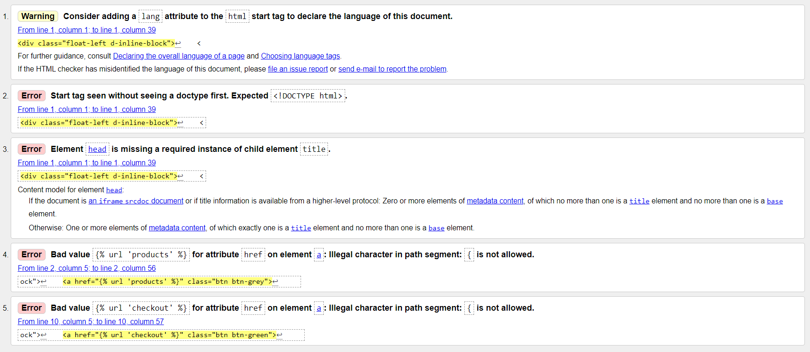
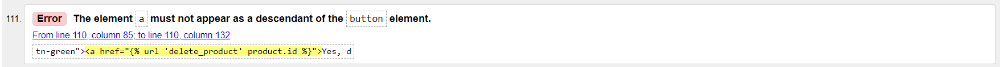
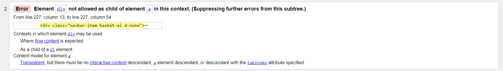
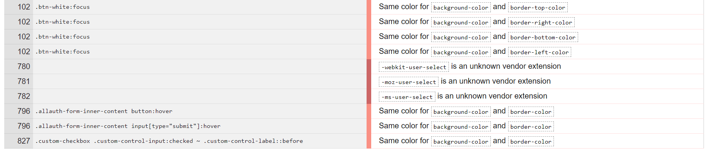
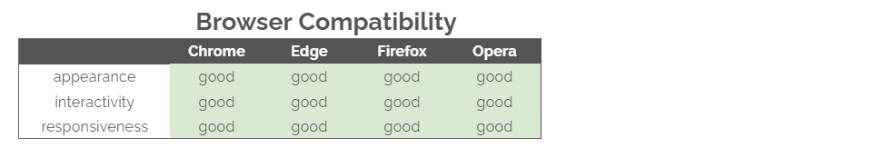

# Testing

- <a href="#1">1. Code Validators</a>
- <a href="#2">2. Responsiveness</a>
- <a href="#3">3. Browser Compatibility</a>
- <a href="#4">4. User Stories</a>
- <a href="#5">5. Bugs</a>

---

## 1. Code validators

### [HTML Validator](https://validator.w3.org/): 
The HTML validator was used on every html file in the project. It mainly returned Django related errors that were ignored. Some examples below:

This test also returned some other non Django related errors. These were all fixed accordingly.

### [CSS Validator](https://jigsaw.w3.org/css-validator/): 
The CSS validator was used on the following files:
- base.css
- checkout.css
- profile.css

The test returned no warnings in checkout.css and profile.css. However, the test returned two type of warnings in the base.css file:
- related to the buttons' colours and borders. These warnings were ignored since they were design choices and they don't affect any functionality of the code.
- related to browser cross-compatibility. These warnings were also ignored in order to have the content render properly on every browser.

The test returned no errors in any of the files

### [JSHint JavaScript Validator](https://jshint.com/):
The JavaScript validator was used on all .js files and JavaScript code snippets in the project. 
The test returned no errors, just a few recommendations about missing semicolons that were fixed.

### [PEP8 Python Validator](http://pep8online.com/): 
The PEP8 Python Validator along with the `python3 -m flake8` command were used on all .py files and some of those files returned a few formatting errors:
- line too long
- trailing whitespace
- no newline at end of file
- continuation line missing indentation or outdented

Most of these formatting errors were fixed successfully.

Some other warnings related to automatically generated files (such as migrations) were ignored since automatically generated files may intentionally ignore style rules for efficiency reasons and because developers usually don't need to touch them, so they don't need to be perfectly readable.

---

## 2. Responsiveness
To test the responsiveness of the site I used [Chrome DevTools](https://developers.google.com/web/tools/chrome-devtools) and [Responsive Design Checker](https://www.responsivedesignchecker.com/).
I also asked some family members and friends to test it on their devices.

---

## 3. Browser compatibility

---

## 4. User Stories

##### Viewing and Navigation
- As a shopper, I want to be able to view a list of products so that I can select some to purchase
    - The user can access the products page from the *home* page and from the navbar at any point

- As a shopper, I want to be able to view individual product details so that I can identify the price, description and product image
    - In the *products* page, the user can click on any product and this will lead them to the *product detail* page. In that page the user can see the price, description and image. Apart from this, some products will have additional information like other names for that product or how to take care of it

- As a shopper, I want to be able to easily view the total of my purchases at anytime so that I can avoid spending too much
    - This feature is only available on larger screen sizes since I thought that for smaller devices it would take up too much space. In smaller devices, the user can view the price of the bag if they click on the *bag* icon on the navbar
    - The user will also see the price of the bag every time they add a product to the bag

- As a shopper, I want to be able to read more about plants so that I can learn a few tips about how to take better care of them
    - The user can read the *blog* to learn more about plants
    - The user can also learn more about the plant they're interested in if they go to the *product detail* page. There they will find some information about water, light or soil, and some other care tips for things like dry flowers

##### Registration and User Account
- As a site user, I want to be able to easily register for an account so that I can have a personal account and be able to view my profile
    - If the user is anonymous, the user can access *my account** from any point in the site and then click on *register*. This will lead them to the page to create an account. 
    - If the user already has an account, when they click on *my account* they won't see the *register* option, but they will see *my profile* and *my wishlist*

- As a site user, I want to be able to easily login or logout so that I can access my personal account information
  - The user will see the *login* (if they're not logged in) or *logout* (if they're already logged in) when they click on the *account* on the navbar

- As a site user, I want to be able to easily recover my password in case I forget it so that I can recover access to my account
    - When the user is trying to log in, they'll see a link to use if they can't remember their password. This will ask the user to type in their account email and an email will be sent to them with the instructions to recover their password

- As a site user, I want to be able to receive an email confirmation after registering so that I can verify that my account registration was successful
    - Every user receives an email confirmation after registering. This email will contain a link to click to finish creating their account and without this last step the account will not be created

- As a site user, I want to be able to have a personalized user profile so that I can view my personal order history and order confirmation, save my payment information and see the products I saved in my favourites list
  - Every user can access their profile page in the navbar when they click *account* and then *my profile*. In *my profile* the user can see their personal order history and order confirmation, they can modify their payment information
  - In that page, the user can also see a link to their wishlist without having to use the navbar 

- As a site user, I want to be able to save products in my wishlist so that I can revisit them if I want to buy them later
    - Every user can access their wishlist in the navbar when they click *account* and then *my wishlist*
    - Additionally, the user can access their wishlist from their profile page

##### Sorting and Searching
- As a shopper, I want to be able to sort the list of available products so that I can easily identify the best priced and categorically sorted products
    - In the *products* page, the user can see a *sort* option just above all products. If they click there they can sort they products by name, price and category

- As a shopper, I want to be able to sort a specific category of product so that I can find the best-priced product in a specific category, or sort the products in that category by name
    - Not only can the user sort the products in the *products* page, but when the user is in a specific category, they can also see the *sort* option just above all products in that category

- As a shopper, I want to be able to search for a product by name or description so that I can find a specific product I'd like to purchase
    - The user can find the *search* option in the navbar from any point in the site

- As a shopper, I want to be able to easily see what I've searched for and the number of results so that I can quickly decide whether the product I want is available
    - The search will return all the results for that term and it will also show the number of results for that searched term

##### Purchasing and Checkout
- As a shopper, I want to be able to easily select the quantity of a product when purchasing it so that I can ensure I don't accidentally select the wrong product or quantity
    - The user can add a product to their shopping bag from the *product detail* page. There the user can adjust the quantity but if they select the wrong one by mistake, they can always adjust the number in the *shopping bag* page

- As a shopper, I want to be able to view items in my bag to be purchased so that I can identify the total cost of my purchase and all items I will receive
    - The user can view their bag by just clicking on the *bag* icon on the navbar
    - Alternatively, the user will see their shopping bag price and items every time they add a new product to their bag

- As a shopper, I want to be able to easily enter my payment information so that I can check out quickly and with no hassles
    - The user can easily enter their payment details when they proceed to *secure checkout* in their *bag* page. There they can see a list of the products they are about to purchase, the delivery information they have to fill in and the card details they have to provide

- As a shopper, I want to be able to feel my personal and payment information is safe and secure so that I can confidently provide the needed information to make a purchase
    - The payment method is secured in the backend with Stripe webhook
    - The user will have to fill in all the required information to proceed with the payment

- As a shopper, I want to be able to view an order confirmation after checkout so that I can verify that I haven't made any mistakes
    - The user can see a list of all the products they're about to purchase in the *checkout* page so they can double check before paying
    - After the payment is made, the user will see an order confirmation with all the details including, products ordered, delivery details, etc

- As a shopper, I want to be able to receive an email confirmation after checking out so that I can keep the confirmation of what I've purchased for my records
    - The user will receive an email after purchasing products to get a second confirmation that their order did successfully go through

##### Admin and Store Management
- As a store owner, I want to be able to add a product so that I can add new items to my store
    - In the navbar option *account*, the users logged in as superusers can see the option *product management - add a product*. This will take the user to a form to add a new product to the shop

- As a store owner, I want to be able to edit/update a product so that I can change product prices, descriptions, images and other product criteria
    - The users logged in as superuser can see the *edit* button on every product in both the *products* page and *product detail* page. If they click on *edit* it will take them to a form to update the product's information.

- As a store owner, I want to be able to delete a product so that I can remove items that are no longer for sale
    - The users logged in as superuser can see the *delete* buttons on every product in both the *products* page and *product detail* page. If they click on *delete*, a modal will appear to make sure the user does want to remove the item and it isn't an accidental click

- As a store owner, I want to be able to add a post to the blog so the shop visitors can also read about plants and how to take care of them
    - In the navbar option *account*, the users logged in as superusers can see the option *product management - add a blog post*. This will take the user to a form to add a new blog post to the blog

- As a store owner, I want to be able to edit/update a blog post
    - The users logged in as superuser can see the *edit* button on every blog post in both the *blog* page and *blog post* page. If they click on *edit* it will take them to a form to update the post's information.

- As a store owner, I want to be able to delete a blog post 
    - The users logged in as superuser can see the *delete* buttons on every blog post in both the *blog* page and *blog post* page. If they click on *delete*, a modal will appear to make sure the user does want to remove the blog post and it isn't an accidental click

---

## 5. Bugs

- NoReverseMatch - When creating the edit blog functionality, a NoReverseMatch error was showing when attempting to go to the main blog page. 
    - Because I was using the same url in both the main blog page and the individual post page, I didn't realize that in the main blog page, the edit button was inside a for loop where the object was called 'post' and not 'blog' like it was called in the views.py file, so I just had to change 'blog' for 'post' and it worked properly.

- TypeError: 'AnonymousUser' object is not iterable - When a non logged in user tried to purchase an item (or many), they would get an error when clicking 'Complete order' in the checkout page. 
  - This was fixed by adding an if statement that would check if the user is authenticated just before saving the order's information in the views.py file in the checkout app.

- Modal deleting wrong product id.
To add security and avoid users (superusers) clicking the delete button by mistake, I decided to add a modal. This modal didn't delete the item I clicked on but it picked the first product 
  - With help from the CI tutors we found out that when a modal with a variable ID is used (meaning there are multiple products on the page), it tends to pick the first one. So to fix this we decided to make the ID dynamic and its match on the button

The same issue occurred with the modal I developed to delete a blog post in the blogs page, and this was fixed the same way

### Bugs to fix
A bug I couldn't fix before submission is the quantity button in the bag app that doesn't work properly in larger screen sizes. I used the same code snippet for both larger screen sizes and smaller screen sizes and while it works perfectly in the smaller versions, in the larger ones the user can press minus and go below zero. 
This isn't a huge issue for the proper functionality of the page because when the user updates the product to be minus, the product will be simply deleted from the shopping bag.

Another bug to fix in the future is the delivery info in the checkout app that saves even with the check button unmarked.

---

[Go back to README.md file](README.md).